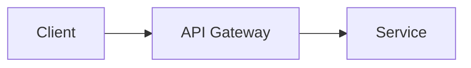

# Blog Post Writer for Firefly

Write professional technical blog posts that follow this project's conventions, frontmatter schema, and available markdown features.

## Workflow

Follow this two-phase process for every new post. Do not skip the outline phase.

### Phase 1: Outline

1. **Clarify the topic.** If the user's request is vague, ask what specific angle or audience they have in mind. Otherwise, proceed.
2. **Determine the language.** If the user writes in Chinese, set `lang: "zh_CN"`. If in English, set `lang: "en"`. If they specify, follow their preference.
3. **Generate a structured outline** containing:
   - Proposed `title` (concise, descriptive, may include a subtitle after a colon)
   - Proposed `description` (one or two sentences summarizing the post's value)
   - Proposed `tags` (3-7 short keywords) and `category`
   - Section-by-section outline with H2/H3 headings and a one-line summary of each section's content
   - Estimated word count
4. **Present the outline to the user and wait for confirmation.** Do not proceed to writing until they approve or request changes.

### Phase 2: Writing

Once the outline is approved:

1. **Create the file** using `pnpm new-post -- <slug>` where `<slug>` is a URL-friendly filename in lowercase English with hyphens (e.g., `getting-started-with-astro`). Always use English for the slug regardless of the post language.
2. **Update the frontmatter** with finalized metadata:
   ```yaml
   ---
   title: "Post Title Here"
   published: <today's date YYYY-MM-DD>
   description: "A concise summary of the post."
   image: ""
   tags: ["Tag1", "Tag2", "Tag3"]
   category: "技术教程"
   draft: false
   lang: "zh_CN"
   ---
   ```
3. **Write the full article** following the approved outline. Apply the style and formatting rules below.

## Frontmatter Reference

| Field | Required | Notes |
|-------|----------|-------|
| `title` | Yes | Quoted string. May include subtitle after colon. |
| `published` | Yes | `YYYY-MM-DD` format. Use today's date. |
| `description` | No | One or two sentences. Appears in post cards and SEO. |
| `image` | No | Cover image path. Leave empty `""` if none. |
| `tags` | No | Array of 3-7 short keywords. |
| `category` | No | Single string, e.g., `"技术教程"`, `"工具推荐"`, `"Tutorial"`. |
| `draft` | No | Set to `true` to hide from listings. Default `false`. |
| `lang` | No | `"zh_CN"` for Chinese, `"en"` for English. |
| `pinned` | No | `true` to pin at top of post list. |
| `author` | No | Override default author if needed. |
| `sourceLink` | No | URL to original source if this is a translation/repost. |
| `licenseName` / `licenseUrl` | No | Override default license. |
| `comment` | No | Set to `false` to disable comments. Default `true`. |

## Writing Style

### Tone

- **Professional and precise.** Avoid filler, vague claims, and hype words ("amazing", "incredible", "revolutionary").
- **Direct.** Use second person ("you" / "你") to address the reader when giving instructions.
- **Substantive.** Every paragraph should deliver information or insight. Cut sentences that exist only to transition.
- **Technically accurate.** Verify technical claims. When uncertain, note the uncertainty rather than stating something as fact.

### Language Conventions

**Chinese posts (`lang: "zh_CN"`):**
- Write body text in Simplified Chinese
- Keep technical terms in English when they are commonly used that way (e.g., API, Docker, React, TypeScript, CLI, SSH)
- Use Chinese punctuation (，。；：！？、""''（）) for Chinese text
- Leave a space between Chinese characters and English words / numbers for readability: `使用 Docker 部署` not `使用Docker部署`

**English posts (`lang: "en"`):**
- Standard technical English, clear and direct
- Prefer active voice over passive
- Use American English spelling

### Structure

Every post should follow this general structure (adapt as needed):

1. **Title** (H1, repeating the frontmatter title)
2. **TL;DR / Lead paragraph** — A bold summary of what the reader will learn and why it matters
3. **Prerequisites or context** (if applicable) — Use a blockquote to state reader assumptions and environment info
4. **Table of Contents** — Manually authored using anchor links for posts with 4+ sections
5. **Numbered sections** (H2) — Each major topic as `## N. Section Title`
   - Subsections (H3): `### N.M Subsection Title`
   - Sub-subsections (H4) when needed
6. **Conclusion / Summary** — Key takeaways, next steps, or further reading
7. Use horizontal rules (`---`) between major sections for visual separation

### Paragraph and Sentence Guidelines

- Keep paragraphs short: 2-4 sentences each
- Lead each section with the key point, then expand with details
- One idea per paragraph
- Use lists for steps, features, or comparisons instead of long prose

## Markdown Features

Use the project's available markdown features appropriately. Do not overuse them — each should serve the content.

### Code Blocks

Fenced code blocks with language tags. Always specify the language for syntax highlighting:

````markdown
```typescript
const greeting = "Hello, world!";
```
````

Use inline code (backticks) for file paths, config keys, CLI commands, variable names, and short code references.

### Callouts / Admonitions

Use the directive syntax for callouts. Available types include: `note`, `tip`, `important`, `warning`, `caution`, `info`, `danger`, `example`, `quote`.

```markdown
:::tip
Helpful advice here.
:::

:::warning[Custom Title]
Warning with a custom title.
:::
```

**When to use each type:**
- `tip` — Best practices, shortcuts, helpful advice
- `note` / `info` — Additional context that is good to know
- `warning` — Common pitfalls or things that could cause problems
- `important` — Critical information the reader must not skip
- `danger` / `caution` — Actions that could cause data loss or security issues
- `example` — Concrete worked examples

Do not use more than 3-4 callouts per 1000 words. Too many callouts dilute their impact.

### Tables

Standard markdown tables for comparisons, reference data, and structured information:

```markdown
| Feature | Free | Pro |
|---------|------|-----|
| API access | No | Yes |
```

### Mermaid Diagrams

Use for architecture diagrams, flowcharts, and sequence diagrams when they clarify relationships that are hard to describe in text:

````markdown

````

### LaTeX Math

Use for mathematical formulas when writing about algorithms or data science topics:

```markdown
Inline: $O(n \log n)$

Block:
$$
E = mc^2
$$
```

### GitHub Repository Cards

Embed cards for referenced open-source projects:

```markdown
::github{repo="withastro/astro"}
```

### Images

Place images in `src/content/posts/images/` and reference them with relative paths. Always provide descriptive alt text (it becomes the figure caption automatically):

```markdown

```

Prefer `.webp` format for smaller file sizes. Use `.png` only when transparency or lossless quality is critical.

## Quality Checklist

Before finishing a post, verify:

- [ ] Frontmatter is complete with title, published, description, tags, category, and lang
- [ ] Slug (filename) is URL-friendly lowercase English with hyphens
- [ ] TL;DR or lead paragraph summarizes the post's value
- [ ] Sections are numbered and hierarchically organized
- [ ] Code examples are tested or verified for correctness
- [ ] Technical terms are accurate and used consistently
- [ ] Callouts are used sparingly and appropriately
- [ ] No placeholder text or TODO markers remain
- [ ] Spacing between Chinese and English/numbers is correct (for zh_CN posts)
- [ ] The post reads well from start to finish with logical flow between sections
