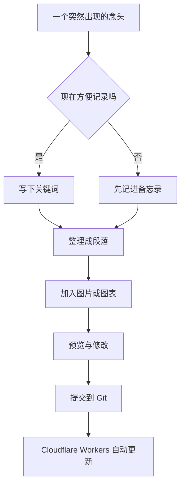
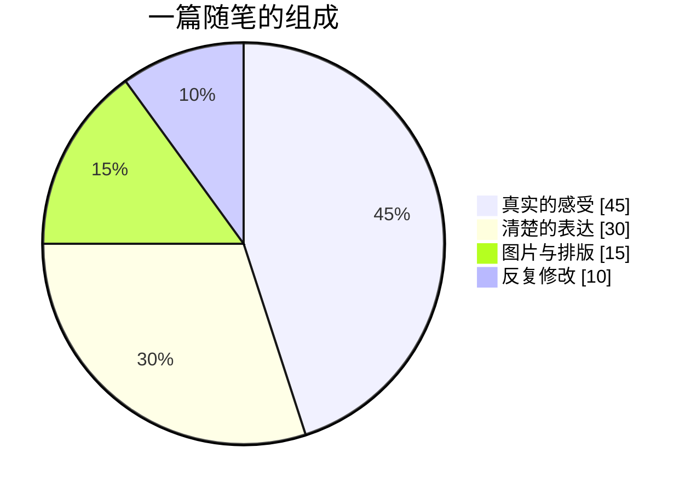

有时候，搭建博客像是在整理一间只属于自己的房间。

最初只是想找个地方放下几句话，后来慢慢添上图片、公式、图表和代码。页面变得越来越丰富，真正重要的却还是同一件事：当某个念头出现时，我愿不愿意把它认真地记录下来。

这篇文章既是一篇随笔，也是一份 Firefly 内容功能测试。封面使用的是本地文件 `test1.avif`，正文中的图片同样直接来自仓库，没有使用图床。

> [!NOTE] 关于这篇测试文章
> 如果图片、公式、图表、仓库卡片和剧透文字都能正常显示，就说明常用的文章功能已经可以正常工作。

## 本地图片

图片不一定要来自遥远的网络。有时，把喜欢的画面和文字放在同一个仓库里，反而更让人安心：文章还在，图片就不会突然失联。

下面这张 PNG 图片使用相对路径插入：

暖色的光、飘落的花瓣，以及画面里聚在一起的人，让人想到那些看似普通、后来却格外值得怀念的时刻。

下面再测试一张 JPG 竖图：

同一个文件夹里可以混合存放 AVIF、PNG 和 JPG。Markdown 只需要写对相对路径，浏览器就能找到它们。

## 把写作变成一条小小的流程

灵感很少按照计划抵达，但我们可以为它准备一个简单的出口。

如果把一篇文章拆开来看，大概可以把完成度写成一个很随意的比例：

图表当然不会替我们思考，但它能把脑海里纠缠在一起的线索摊开，让关系变得更清楚。

## 偶尔也写一点公式

生活很难被公式精确描述，不过公式拥有一种令人安心的秩序感。

行内公式可以自然地放进句子里。例如，质能方程 $E = mc^2$ 只用了几个字符，却连接了质量与能量。

块级公式则适合单独展示。欧拉恒等式把几个重要的数学常数放在了一起：

$$
e^{i\pi} + 1 = 0
$$

再写一个高斯积分：

$$
\int_{-\infty}^{\infty} e^{-x^2}\,dx = \sqrt{\pi}
$$

如果把每天写下的内容量记为 $w_n$，那么一段时间积累的文字总量可以写成：

$$
W = \sum_{n=1}^{N} w_n
$$

真正让博客逐渐丰厚的，也许不是某一天写了很多，而是 $w_n$ 经常不等于零。

## 本周 GitHub 热门仓库卡片

下面五个仓库来自 GitHub Weekly Trending 在 2026 年 7 月 28 日显示的前五名。榜单会随时间变化，这里保留的是写作时的一个切片。

### 1. ayghri/i-have-adhd

::github{repo="ayghri/i-have-adhd"}

### 2. koala73/worldmonitor

::github{repo="koala73/worldmonitor"}

### 3. bojieli/ai-agent-book

::github{repo="bojieli/ai-agent-book"}

### 4. oblien/openship

::github{repo="oblien/openship"}

### 5. agegr/pi-web

::github{repo="agegr/pi-web"}

热门榜单像一扇快速移动的窗口。今天大家关注的是这些项目，下周或许就会出现完全不同的名字。比起追赶每一次变化，更有意思的是偶尔停下来看看：人们正在试图解决什么问题。

## 留一个小小的剧透

下面这句话使用了 Firefly 的剧透文本语法：

真正的秘密是 :spoiler[这篇文章不只是功能测试，它也是博客开始认真记录生活的一个小小起点。]

## 写在最后

一篇测试文章不必只有冷冰冰的占位文字。图片负责保存光影，公式负责维持秩序，图表负责梳理路径，而文字负责把它们留在同一个时刻。

等到以后回头看，也许最先注意到的不是某一种 Markdown 语法，而是自己曾经在这里停留过，并且认真写下了一点什么。
